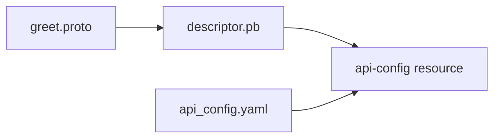
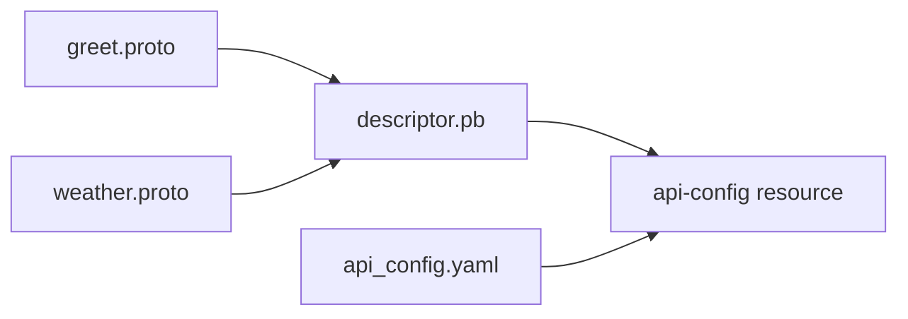

# go-connect-greet
[Connect for Go.](https://connectrpc.com/docs/go/getting-started/)

## Configure API Gateway.
### Install protoc.
- Compile the proto file and create the generated descriptor set (`.pb` file).
- [Get Started Cloud Run for gRPC](https://cloud.google.com/api-gateway/docs/get-started-cloud-run-grpc?hl=ja)
- [protobuf](https://github.com/protocolbuffers/protobuf/releases)
```bash
cd /workspaces/go-connect-greet/

wget https://github.com/protocolbuffers/protobuf/releases/download/v24.2/protoc-24.2-linux-x86_64.zip
unzip protoc-24.2-linux-x86_64.zip 
mv bin/protoc /usr/local/bin/
```


```bash
protoc --proto_path=greet/v1 \
    --descriptor_set_out=./descriptor.pb \
    greet.proto
```

### Create `api_config.yaml`
```yaml
# The configuration schema is defined by the service.proto file.
# https://github.com/googleapis/googleapis/blob/master/google/api/service.proto

type: google.api.Service
config_version: 3
# In the name field, a service named *.apigateway.PROJECT_ID.cloud.goog where PROJECT_ID is the name of your Google Cloud project ID.
name: "*.apigateway.groundmeat-375705.cloud.goog"
title: API Gateway + Cloud Run gRPC
apis:
  # package + service id
  - name: greet.v1.GreetService
usage:
  rules:
  # ListShelves methods can be called without an API Key.
  # package + service id + rpc
  - selector: greet.v1.GreetService.Greet
    allow_unregistered_calls: true
backend:
  rules:
    # Note: To use gRPC with TLS on Cloud Run, the address field must have the scheme grpcs:// instead of https://.
    - selector: "*"
      address: grpcs://go-connect-greet-xxxx-an.a.run.app
```

## Environments.
```bash
# API Gateway
export PROJECT_ID="groundmeat-375705"
export APIGATEWAY_API="groundmeat-grpc"
export APIGATEWAY_CONFIG_ID="grpc-config"
export GATEWAY_ID="groundmeat-gw"
export GATEWAY_REGION="asia-northeast1"
# Custom Domain
export SERVERLESS_NEG_NAME="groundmeat-api-gw-serverless-neg"
export BACKEND_SERVICE_NAME="groundmeat-api-gw-backend-svc"
export URL_MAP_NAME="groundmeat-api-gw-url-map"
export IP_CUSTOM_DOMAIN="groundmeat-api-dev"
export GW_CUSTOM_DOMAIN="hoge.example.jp"
export SSL_CERTIFICATE_NAME="groundmeat-api-cert"
export TARGET_HTTP_PROXY_NAME="groundmeat-api-gw-https-proxy"
export HTTPS_FORWARDING_RULE_NAME="groundmeat-api-fw"
```
### Create api-configs.
```bash
cd /workspaces/go-connect-greet/api-gateway/greet/

gcloud api-gateway api-configs create $APIGATEWAY_CONFIG_ID \
--api=$APIGATEWAY_API --project=$PROJECT_ID \
--grpc-files=descriptor.pb,api_config.yaml
```

```bash
gcloud api-gateway api-configs describe $APIGATEWAY_CONFIG_ID \
  --api=$APIGATEWAY_API --project=$PROJECT_ID
```

### Create API Gateway.
```bash
gcloud api-gateway gateways create $GATEWAY_ID \
  --api=$APIGATEWAY_API --api-config=$APIGATEWAY_CONFIG_ID \
  --location=$GATEWAY_REGION --project=$PROJECT_ID
```

### Sending a request to the API.
```bash
curl \
    --header "Content-Type: application/json" \
    --data '{"name": "Jane"}' \
https://groundmeat-gw-8g4o26at.an.gateway.dev/greet.v1.GreetService/Greet
```

## Configure HTTP(S) Load Balancing for API Gateway.
```bash
gcloud beta compute network-endpoint-groups create $SERVERLESS_NEG_NAME \
  --region=$GATEWAY_REGION \
  --network-endpoint-type=serverless \
  --serverless-deployment-platform=apigateway.googleapis.com \
  --serverless-deployment-resource=$GATEWAY_ID
```

```bash
gcloud beta compute network-endpoint-groups describe $SERVERLESS_NEG_NAME --region=$GATEWAY_REGION
```

```bash
gcloud compute backend-services create $BACKEND_SERVICE_NAME \
  --global

gcloud compute backend-services add-backend $BACKEND_SERVICE_NAME \
  --global \
  --network-endpoint-group=$SERVERLESS_NEG_NAME \
  --network-endpoint-group-region=$GATEWAY_REGION

gcloud compute url-maps create $URL_MAP_NAME \
  --default-service $BACKEND_SERVICE_NAME

gcloud compute addresses create $IP_CUSTOM_DOMAIN \
  --ip-version=IPV4 \
  --global

gcloud compute ssl-certificates create $SSL_CERTIFICATE_NAME \
  --domains $GW_CUSTOM_DOMAIN

gcloud compute target-https-proxies create $TARGET_HTTP_PROXY_NAME \
  --ssl-certificates=$SSL_CERTIFICATE_NAME \
  --url-map=$URL_MAP_NAME

gcloud compute forwarding-rules create $HTTPS_FORWARDING_RULE_NAME \
  --target-https-proxy=$TARGET_HTTP_PROXY_NAME \
  --global \
  --ports=443
```

- Change the A record of DOMAIN to the IP address obtained by the following command.
```bash
gcloud compute forwarding-rules list
```

### Sending a request to the API.
```bash
curl \
    --header "Content-Type: application/json" \
    --data '{"name": "Jane"}' \
https://hoge.example.jp/greet.v1.GreetService/Greet
```

```bash
cp weather/v1/weather.proto .
protoc --proto_path=weather/v1 \
    --include_imports \
    --include_source_info \
    --descriptor_set_out=./weather.pb \
    weather.proto
protoc --proto_path=greet/v1 \
    --include_imports \
    --include_source_info \
    --descriptor_set_out=./greet.pb \
    greet.proto
mv descriptor.pb api-gateway/weather/.

curl \
    --header "Content-Type: application/json" \
    --data '{"condition": "Sunny"}' \
    https://go-connect-weather-xxxx-an.a.run.app/weather.v1.WeatherService/Weather
```

## Summarize the two APIs.
### Create a new api-config.


```bash
export APIGATEWAY_CONFIG_ID_B="grpc-config-2"

cd /workspaces/go-connect-greet/api-gateway/
cp ../weather/v1/weather.proto .
cp ../greet/v1/greet.proto .
# Create a descriptor set (`.pb` file) generated from the two .proto files.
protoc --proto_path=. --descriptor_set_out=./descriptor.pb greet.proto weather.proto 
```

```bash
gcloud api-gateway api-configs create $APIGATEWAY_CONFIG_ID_B \
--api=$APIGATEWAY_API --project=$PROJECT_ID \
--grpc-files=api_config.yaml,descriptor.pb
```

### Edit the console screen; switch to api-config.
